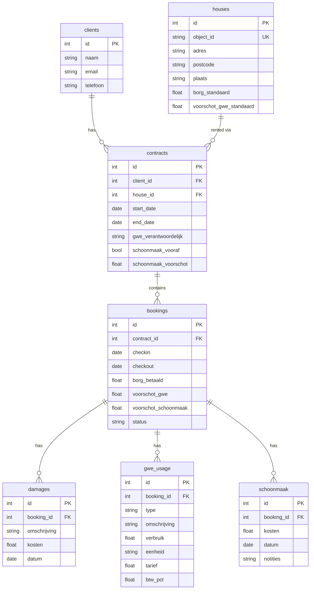

# Database Architecture Redesign: ryanrent_v2.db

## Goal
Create a clean database where data naturally flows from input (parsers) to output (eindafrekening generation).

---

## Schema Overview



---

## Tables Detail

### 1. `clients` - Klanten
| Column | Type | Description |
|--------|------|-------------|
| id | INTEGER PK | Auto-increment |
| naam | TEXT | Client name |
| email | TEXT | Contact email |
| telefoon | TEXT | Phone number |

### 2. `houses` - Huizen
| Column | Type | Description |
|--------|------|-------------|
| id | INTEGER PK | Auto-increment |
| object_id | TEXT UNIQUE | RyanRent object ID (e.g., "0135") |
| adres | TEXT | Street address |
| postcode | TEXT | Postal code |
| plaats | TEXT | City |
| borg_standaard | REAL | Default deposit amount |
| voorschot_gwe_standaard | REAL | Default GWE advance |

### 3. `verhuur_contracten` - Verhuurcontracten (Klant ↔ Huis)
> *Note: We have both "verhuur" (rental to client) and "inhuur" (from supplier) contracts. This table is specifically for verhuur.*

| Column | Type | Description |
|--------|------|-------------|
| id | INTEGER PK | Auto-increment |
| client_id | INTEGER FK | → clients.id |
| house_id | INTEGER FK | → houses.id |
| start_date | DATE | Contract start |
| end_date | DATE | Contract end (nullable) |
| gwe_verantwoordelijk | TEXT | "client" or "ryanrent" |
| schoonmaak_vooraf | BOOLEAN | Cleaning paid in advance? |
| schoonmaak_voorschot | REAL | Advance amount if applicable |

### 4. `bookings` - Boekingen (Werkelijke uitvoering van contract)
> *This represents the actual execution: real check-in/out dates, actual amounts paid.*

| Column | Type | Description |
|--------|------|-------------|
| id | INTEGER PK | Auto-increment |
| contract_id | INTEGER FK | → verhuur_contracten.id |
| checkin | DATE | Actual check-in date |
| checkout | DATE | Actual check-out date |
| borg_betaald | REAL | Actual deposit paid |
| voorschot_gwe | REAL | Actual GWE advance paid |
| voorschot_schoonmaak | REAL | Actual cleaning advance |
| status | TEXT | "active", "completed", "cancelled" |

### 5. `damages` - Schade-gerelateerde kosten
> *Not just physical damage - can also be services performed to fix damage (TD-werk, etc.)*

| Column | Type | Description |
|--------|------|-------------|
| id | INTEGER PK | Auto-increment |
| booking_id | INTEGER FK | → bookings.id |
| omschrijving | TEXT | Description (e.g., "TD-werk muur sauzen") |
| aantal | REAL | Quantity (default 1) |
| tarief | REAL | Rate per unit (excl VAT) |
| kosten | REAL | Total cost (aantal × tarief) |
| btw_pct | REAL | VAT percentage (0.09 or 0.21) |
| datum | DATE | Date recorded |

### 6. `gwe_usage` - GWE Verbruik
> *Water has fixed tariffs (stored in code constants). Gas/Elektra tariffs come from supplier invoice and are stored per line.*

| Column | Type | Description |
|--------|------|-------------|
| id | INTEGER PK | Auto-increment |
| booking_id | INTEGER FK | → bookings.id |
| type | TEXT | "Water", "Gas", "Elektra" |
| omschrijving | TEXT | Line item description |
| verbruik | REAL | Consumption amount |
| eenheid | TEXT | "m³", "kWh", "dag" |
| tarief | REAL | Rate per unit (excl VAT) - *for Water: auto-filled from constants* |
| btw_pct | REAL | VAT percentage |

> **Design note**: For Water, we can auto-populate tarief using `Calculator.WATER_TARIEF_*` constants. For Gas/Elektra, tarief is entered from the supplier invoice.

### 7. `schoonmaak` - Schoonmaak
| Column | Type | Description |
|--------|------|-------------|
| id | INTEGER PK | Auto-increment |
| booking_id | INTEGER FK | → bookings.id |
| kosten | REAL | Actual cleaning cost |
| datum | DATE | Date performed |
| notities | TEXT | Notes |

---

## Eindafrekening Calculation Flow

```sql
-- Get all data for eindafrekening in one query
SELECT 
    b.id as booking_id,
    b.checkin, b.checkout,
    b.borg_betaald, b.voorschot_gwe, b.voorschot_schoonmaak,
    c.naam as client_naam,
    h.adres, h.object_id,
    COALESCE(SUM(d.kosten), 0) as total_damages,
    COALESCE(SUM(g.verbruik * g.tarief * (1 + g.btw_pct)), 0) as total_gwe,
    COALESCE(SUM(s.kosten), 0) as total_schoonmaak
FROM bookings b
JOIN contracts ct ON b.contract_id = ct.id
JOIN clients c ON ct.client_id = c.id
JOIN houses h ON ct.house_id = h.id
LEFT JOIN damages d ON d.booking_id = b.id
LEFT JOIN gwe_usage g ON g.booking_id = b.id
LEFT JOIN schoonmaak s ON s.booking_id = b.id
WHERE b.id = ?
GROUP BY b.id;
```

---

## Implementation Steps

1. [ ] Create `database/ryanrent_v2.db` with schema
2. [ ] Update `Shared/database.py` to support new DB
3. [ ] Migrate essential data from old DB (houses, clients)
4. [ ] Update `parse_schadekosten.py` to write to `damages` table
5. [ ] Update `master_reader.py` to read from new DB
6. [ ] Update eindafrekening generator to use new flow
