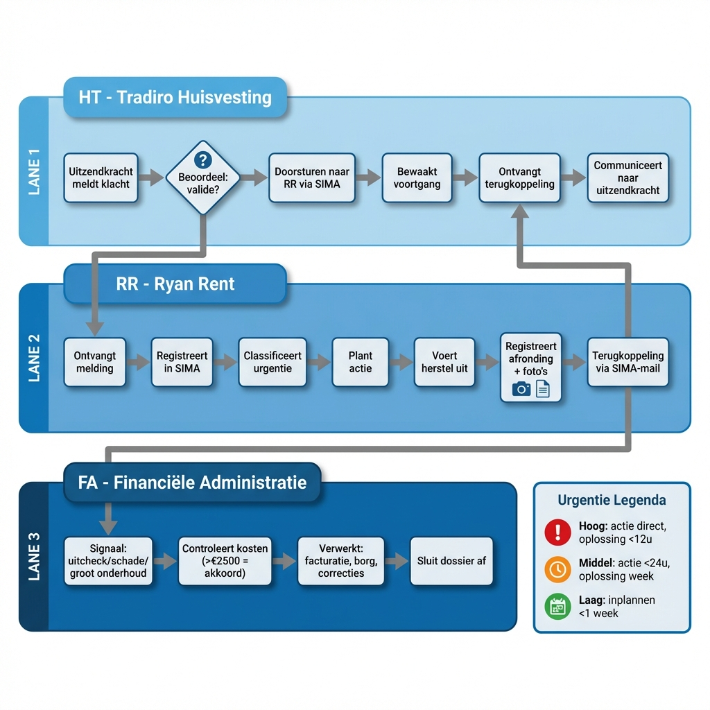

# Klachtenafhandeling Proces

## Swimlane Diagram

---

## Urgentieniveaus (SLA Artikel 5)

| Niveau | Definitie | Actie | Oplossing |
|--------|-----------|-------|-----------|
| 🔴 **Hoog** | Direct gevaar of ernstig ongemak | Onmiddellijk | < 12 uur |
| 🟠 **Middel** | Hinderlijk, geen direct gevaar | < 24 uur | Dezelfde kalenderweek |
| 🟢 **Laag** | Regulier onderhoud, kleine gebreken | Inplannen < 1 week | Week daaropvolgend |

---

## Terugkoppeling (SLA Artikel 6)

| Type | Termijn |
|------|---------|
| Gewoon bericht | 2 werkdagen |
| Onderhoudsbericht | Dezelfde dag |
| Na uitvoering | 24 uur (via SIMA-mail) |

---

## Escalatiepad

| Moment | Actie |
|--------|-------|
| **T = 0** | Melding gedaan |
| **T + 24u** | Geen actie → HT escaleert naar RR |
| **T + 48u** | Geen oplossing → HT → Christa |
| **SNF-risico** | Direct escaleren, geen wachttijd |

---

## Groot Onderhoud (SLA Artikel 7)

- Uitgaven > €2.500 → verplichte afstemming met FA Tradiro
- Kosten worden over 5 jaar uitgesmeerd
- Toeslag: 4% rente per jaar over investering
